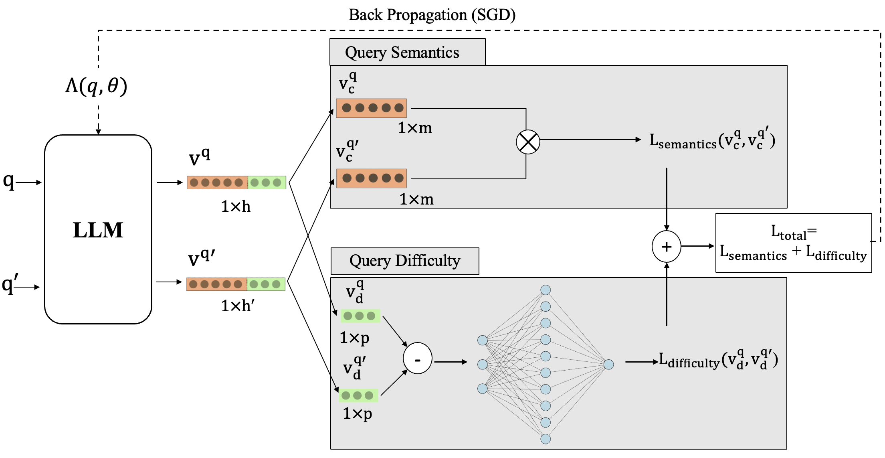

# Neural Disentanglement of Query Difficulty and Semantics

This repository contains the implementation and experiments for the paper titled "Neural Disentanglement of Query Difficulty and Semantics." The paper investigates the impact of factors beyond query semantics on retrieval effectiveness and presents a novel neural disentanglement method to separate query semantics from query difficulty. The disentangled representations enable determining semantic associations between queries and estimating query effectiveness.

## Methodology
The major objective of our work in this paper is to disentangle query representations such that query semantics and query difficulty are decomposed into distinguishable portions of the original representation. The hypothesis of our work is that a disentangled representation that separates query semantics from query difficulty has a higher chance of showing better performance on the query performance prediction task since the disentangled query difficulty representation is specifically fine-tuned for this purpose. In addition, the disentangled representation of the query that captures query semantics would be able to more accurately represent the content of the query and hence show better performance when determining semantic similarity between query pairs.

  

## Dataset

## Repository structure

## Usage

